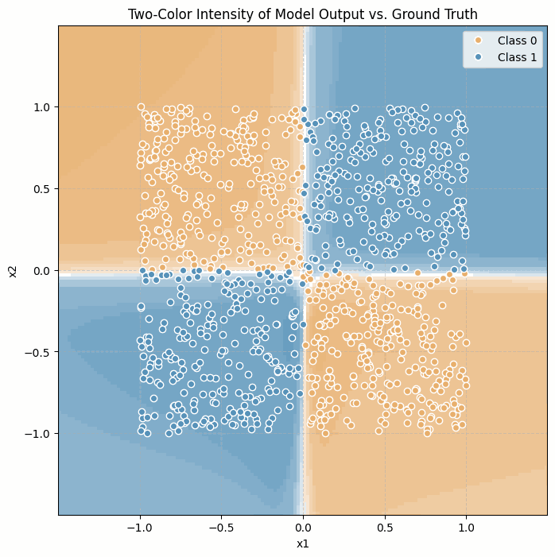
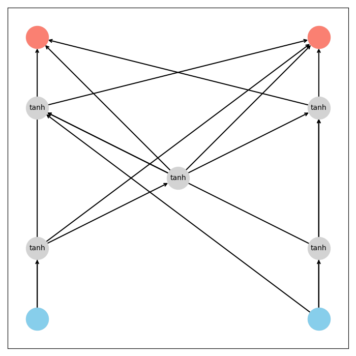
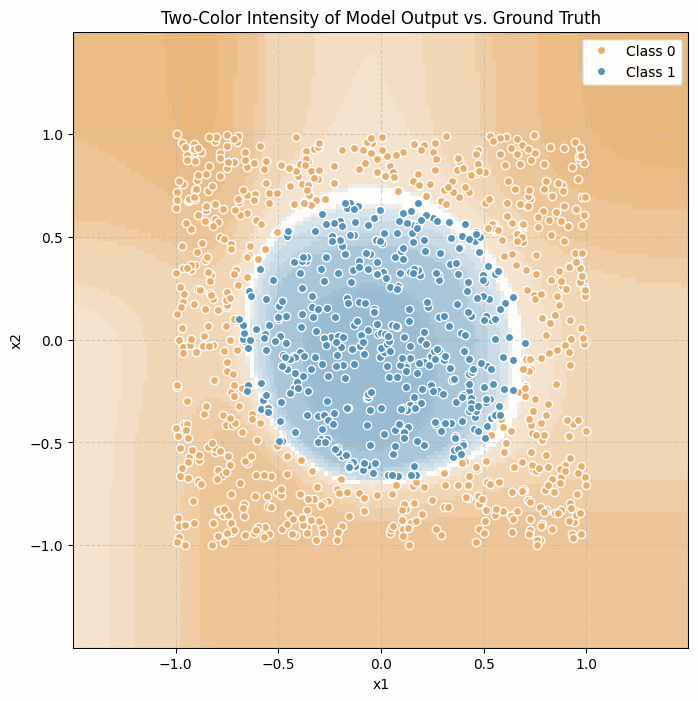
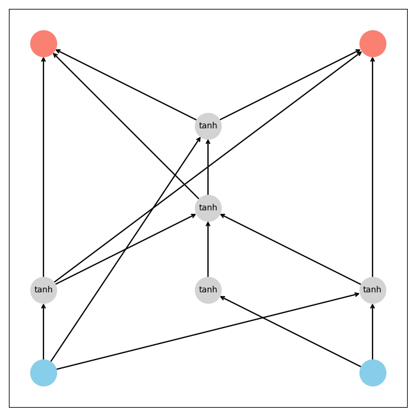
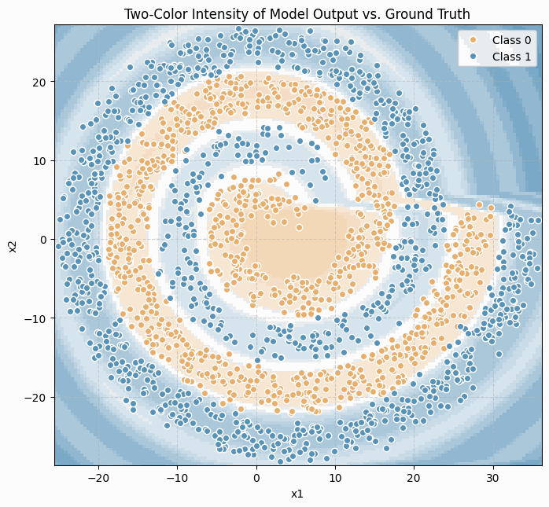
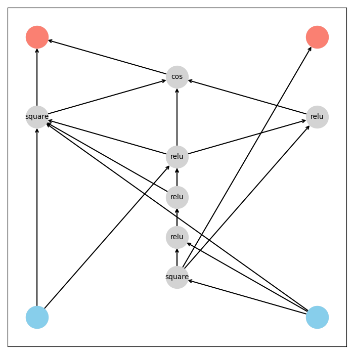
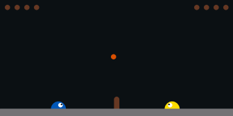
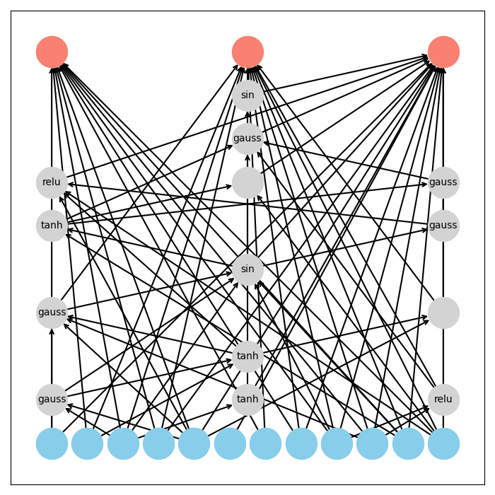

# NEAT

## installation

**Install JAX**: 
Please first follow JAX's [installation instruction](https://github.com/google/jax#installation) with optional GPU/TPU backend support.
In case JAX is not set up, EvoJAX installation will still try pulling a CPU-only version of JAX.
Note that Colab runtimes come with JAX pre-installed.

Install EvoJAX:
```
# Install from PyPI.
pip install evojax
```

## Training

### XOR

```bash
python train.py \
    "task.name=xor" \
    "neat.prob_add_node=0.05" \
    "neat.prob_add_connection=0.15" \
    "neat.compatibility_threshold=3.0" \
    "trainer.max_iter=20" \
    "trainer.learning_rate=0.1" \
    "trainer.l2_penalty=0.001"
```

### Circle

```bash
python train.py \
    "task.name=circle" \
    "neat.prob_add_node=0.05" \
    "neat.prob_add_connection=0.15" \
    "neat.compatibility_threshold=3.0" \
    "trainer.max_iter=20" \
    "trainer.learning_rate=0.1" \
    "trainer.l2_penalty=0.001"
```

### Spiral

```bash
python train.py \
    "task.name=spiral" \
    "neat.pop_size=150" \
    "neat.prob_add_node=0.05" \
    "neat.prob_add_connection=0.15" \
    "neat.compatibility_threshold=3.0" \
    "neat.activation_function=[relu,square,sin,cos]" \
    "trainer.max_iter=100" \
    "trainer.backprop_steps=1000" \
    "trainer.learning_rate=0.03" \
    "trainer.l2_penalty=0.000"

```

### SlimeVolley

```bash
python train.py \
    "task.name=slimevolley" \
    "task.max_steps=3000" \
    "neat.pop_size=300" \
    "neat.prob_add_node=0.05" \
    "neat.prob_add_connection=0.15" \
    "neat.compatibility_threshold=3.0,2.0,1.0,0.5" \
    "neat.survival_threshold=0.25" \
    "neat.activation_function=[relu,square,sin,tanh,gaussian,identity]" \
    "trainer.n_repeats=16" \
    "trainer.n_evaluations=100" \
    "trainer.max_iter=2000" \
    "trainer.test_interval=50" \
    "trainer.log_interval=10" \
    "trainer.backprop_steps=1000" \
    "trainer.learning_rate=0.01" \
    "trainer.l2_penalty=0.001" \
    -m
```

## Experiments Overview

### XOR
Initially, even with a correct NEAT implementation, the networks failed to learn the XOR function. The main issue was the setup of sgd and the choice of activation functions. Only after figuring out which network architecture works for the problem and setting activation function to tanh for hidden neurons and identity for output neurons it worked. Once these adjustments were made, the networks began to solve the XOR task very quickly (10 iterations).

<div style="display: flex; gap: 10px;">
    
    
</div>

### Circle
After successfully solving XOR, the next test was the Circle task, which requires the network to classify points as inside or outside a circle. Leveraging the working setup from XOR (especially the activation function choices), NEAT was able to solve the Circle task almost instantly. 

<div style="display: flex; gap: 10px;">
    
    
</div>

### Spiral
The Spiral classification task was more challenging due to its highly non-linear and intertwined decision boundaries. Initial attempts using only tanh activations were unsuccessful but after I changed the number of backprop steps to 1000 and activation to relu it started learning. When I expanded the set of possible activation functions to include relu, square, and sin the training become even faster, although still required about 1000 sgd steps. 

<div style="display: flex; gap: 10px;">
    
    
</div>

### SlimeVolley
After my initial attempts to train a Slime Volley agent using backpropagation and a combined backprop-NEAT approach failed, I only have found success by using the NEAT algorithm exclusively, without any backpropagation.

<div style="display: flex; gap: 10px;">
    
    
</div>
